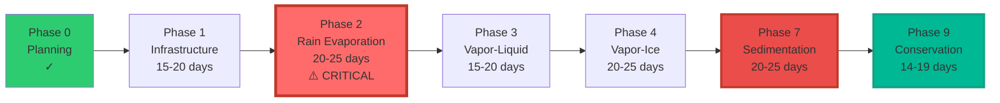
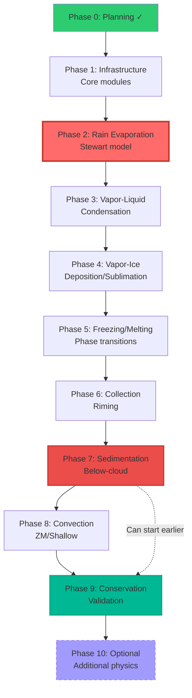
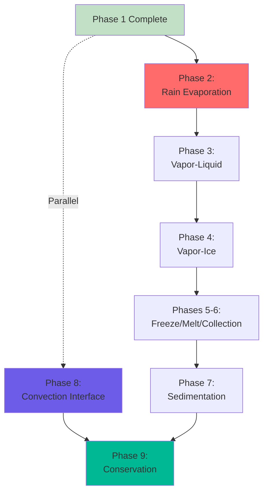

# P3 Water Isotope Implementation - Dependency Diagram

```mermaid
graph TB
    %% Phase 0
    P0[Phase 0: Planning ✓]
    
    %% Phase 1
    P1_1[1.1: Port water_isotopes.F90]
    P1_2[1.2: Port water_types.F90]
    P1_3[1.3: Port water_tracer_vars.F90]
    P1_4[1.4: Port water_tracers core]
    P1_5[1.5: Extend physics_state]
    P1_6[1.6: Register constituents]
    P1_7[1.7: Add namelist config]
    
    %% Phase 2
    P2_1[2.1: Modify evaporate_rain]
    P2_2[2.2: Create wtrc_p3_inter]
    P2_3[2.3: Port stewart_isoevap]
    P2_4[2.4: Port wtrc_equil_time]
    P2_5[2.5: Port wtrc_liqvap_equil]
    P2_6[2.6: Port wtrc_apply_rates]
    P2_7[2.7: Integrate with P3]
    P2_8[2.8: Phase 2 Testing]
    
    %% Phase 3
    P3_1[3.1: Modify autoconversion]
    P3_2[3.2: Modify accretion]
    P3_3[3.3: Extract condensation]
    P3_4[3.4: Port wtrc_vap_distil]
    P3_5[3.5: Extend apply_rates]
    P3_6[3.6: Phase 3 Testing]
    
    %% Phase 4
    P4_1[4.1: Modify ice_nucleation]
    P4_2[4.2: Modify deposition/sublim]
    P4_3[4.3: Modify ice_supersat]
    P4_4[4.4: Implement ice fractionation]
    P4_5[4.5: Extend apply_rates]
    P4_6[4.6: Phase 4 Testing]
    
    %% Phase 5
    P5_1[5.1: Modify freezing functions]
    P5_2[5.2: Modify melting functions]
    P5_3[5.3: Implement freezing frac]
    P5_4[5.4: Implement melting]
    P5_5[5.5: Extend apply_rates]
    P5_6[5.6: Phase 5 Testing]
    
    %% Phase 6
    P6_1[6.1: Modify collection functions]
    P6_2[6.2: Implement collection frac]
    P6_3[6.3: Handle Bergeron]
    P6_4[6.4: Extend apply_rates]
    P6_5[6.5: Phase 6 Testing]
    
    %% Phase 7
    P7_1[7.1: Modify rain_sedimentation]
    P7_2[7.2: Modify ice_sedimentation]
    P7_3[7.3: Port wtrc_sediment]
    P7_4[7.4: Integrate sedimentation]
    P7_5[7.5: Phase 7 Testing]
    
    %% Phase 8
    P8_1[8.1: Port ZM convection]
    P8_2[8.2: Port shallow convection]
    P8_3[8.3: Phase 8 Testing]
    
    %% Phase 9
    P9_1[9.1: Port conservation]
    P9_2[9.2: Port diagnostics]
    P9_3[9.3: Global validation]
    
    %% Phase 10
    P10_1[10.1: Methane oxidation]
    P10_2[10.2: HTO decay]
    P10_3[10.3: CLUBB interface]
    P10_4[10.4: Surface fluxes]
    
    %% Dependencies
    P0 --> P1_1
    P1_1 --> P1_2
    P1_2 --> P1_3
    P1_3 --> P1_4
    P1_4 --> P1_5
    P1_5 --> P1_6
    P1_6 --> P1_7
    
    P1_7 --> P2_1
    P2_1 --> P2_2
    P2_2 --> P2_3
    P2_3 --> P2_4
    P2_4 --> P2_5
    P2_5 --> P2_6
    P2_6 --> P2_7
    P2_7 --> P2_8
    
    P2_8 --> P3_1
    P3_1 --> P3_2
    P3_2 --> P3_3
    P3_3 --> P3_4
    P3_4 --> P3_5
    P3_5 --> P3_6
    
    P3_6 --> P4_1
    P4_1 --> P4_2
    P4_2 --> P4_3
    P4_3 --> P4_4
    P4_4 --> P4_5
    P4_5 --> P4_6
    
    P4_6 --> P5_1
    P5_1 --> P5_2
    P5_2 --> P5_3
    P5_3 --> P5_4
    P5_4 --> P5_5
    P5_5 --> P5_6
    
    P5_6 --> P6_1
    P6_1 --> P6_2
    P6_2 --> P6_3
    P6_3 --> P6_4
    P6_4 --> P6_5
    
    P6_5 --> P7_1
    P7_1 --> P7_2
    P7_2 --> P7_3
    P7_3 --> P7_4
    P7_4 --> P7_5
    
    P7_5 --> P8_1
    P8_1 --> P8_2
    P8_2 --> P8_3
    
    P8_3 --> P9_1
    P9_1 --> P9_2
    P9_2 --> P9_3
    
    P9_3 --> P10_1
    P10_1 --> P10_2
    P10_2 --> P10_3
    P10_3 --> P10_4
    
    %% Styling
    classDef phase0 fill:#d4c5f9
    classDef phase1 fill:#c2e0c6
    classDef phase2 fill:#ff6b6b
    classDef phase3 fill:#4ecdc4
    classDef phase4 fill:#45b7d1
    classDef phase5 fill:#f9ca24
    classDef phase6 fill:#f0932b
    classDef phase7 fill:#eb4d4b
    classDef phase8 fill:#6c5ce7
    classDef phase9 fill:#00b894
    classDef phase10 fill:#a29bfe
    classDef completed fill:#2ecc71
    
    class P0 completed
    class P1_1,P1_2,P1_3,P1_4,P1_5,P1_6,P1_7 phase1
    class P2_1,P2_2,P2_3,P2_4,P2_5,P2_6,P2_7,P2_8 phase2
    class P3_1,P3_2,P3_3,P3_4,P3_5,P3_6 phase3
    class P4_1,P4_2,P4_3,P4_4,P4_5,P4_6 phase4
    class P5_1,P5_2,P5_3,P5_4,P5_5,P5_6 phase5
    class P6_1,P6_2,P6_3,P6_4,P6_5 phase6
    class P7_1,P7_2,P7_3,P7_4,P7_5 phase7
    class P8_1,P8_2,P8_3 phase8
    class P9_1,P9_2,P9_3 phase9
    class P10_1,P10_2,P10_3,P10_4 phase10
```



## Critical Path Visualization



## Phase Dependencies (Simplified)



## Parallel Work Opportunities

Some tasks can be worked on in parallel once Phase 1 is complete:



**Note**: Convection (Phase 8) can be developed in parallel with Phases 2-7 since it's largely independent, then integrated in Phase 9.

## Estimated Timeline

Assuming sequential development with 1 FTE:

```
┌──────────────────────────────────────────────────────────┐
│ Month 1-2    │ Phase 1: Infrastructure (15-20 days)      │
├──────────────┼───────────────────────────────────────────┤
│ Month 2-3    │ Phase 2: Rain Evaporation (20-25 days)   │
├──────────────┼───────────────────────────────────────────┤
│ Month 4      │ Phase 3: Vapor-Liquid (15-20 days)       │
├──────────────┼───────────────────────────────────────────┤
│ Month 5-6    │ Phase 4: Vapor-Ice (20-25 days)          │
├──────────────┼───────────────────────────────────────────┤
│ Month 6-7    │ Phase 5: Freeze/Melt (15-20 days)        │
├──────────────┼───────────────────────────────────────────┤
│ Month 7-8    │ Phase 6: Collection (15-20 days)         │
├──────────────┼───────────────────────────────────────────┤
│ Month 8-9    │ Phase 7: Sedimentation (20-25 days)      │
├──────────────┼───────────────────────────────────────────┤
│ Month 10     │ Phase 8: Convection (12-16 days)         │
├──────────────┼───────────────────────────────────────────┤
│ Month 11     │ Phase 9: Conservation (14-19 days)       │
├──────────────┼───────────────────────────────────────────┤
│ Month 12     │ Phase 10: Optional (15-22 days)          │
└──────────────┴───────────────────────────────────────────┘
```

**With 2 FTEs and parallel work**: ~6-8 months for Phases 1-9

---

## Priority Indicators

🔴 **Critical Priority** - On critical path, must be completed
- Phase 1 (Infrastructure)
- Phase 2 (Rain Evaporation) - **HIGHEST SCIENTIFIC PRIORITY**
- Phase 7 (Sedimentation)
- Phase 9 (Conservation & Validation)

🟠 **High Priority** - Important for completeness
- Phase 3 (Vapor-Liquid)
- Phase 4 (Vapor-Ice)
- Phase 8 (Convection)

🟡 **Medium Priority** - Adds value, can be simplified if needed
- Phase 5 (Freezing/Melting)
- Phase 6 (Collection)

🟢 **Low Priority** - Optional enhancements
- Phase 10 (Additional Physics)

---

## Notes on Diagrams

These diagrams use Mermaid syntax and should render properly in:
- GitHub
- GitLab
- Many markdown viewers
- VS Code with Mermaid extension

If diagrams don't render, view the raw markdown or use a Mermaid viewer online.

---

**Legend**:
- Solid arrows (→): Required dependency
- Dashed arrows (-.->): Optional/alternative path
- ✓: Completed
- ⚠️: High priority/critical
- Thick borders: Critical path items
